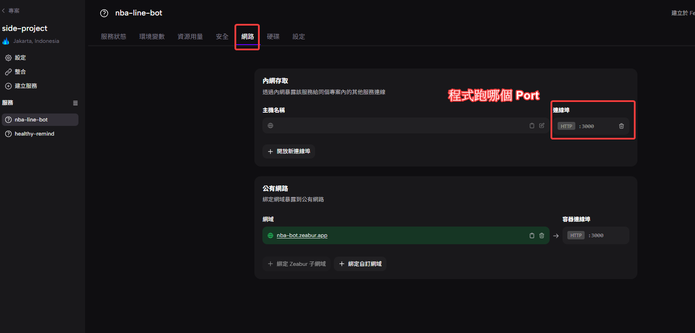
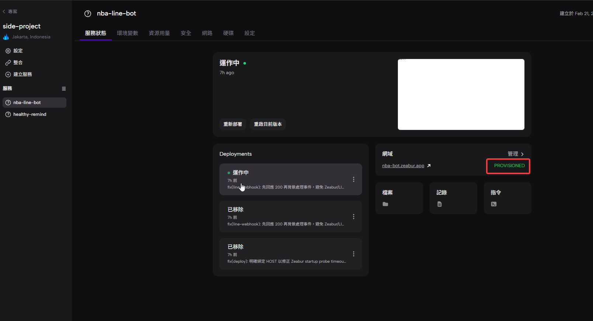

**PROVISIONED** 在 Zeabur 裡通常代表：

> 已成功配置完成，資源已建立並可使用

在 Zeabur 的部署流程中，常見狀態包含：

*   **Pending** → 等待建立中
*   **Provisioning** → 正在建立資源（例如 Container、Pod、Volume、Database）
*   **Provisioned** → ✅ 資源已建立完成
*   **Running** → 服務正在運行
*   **Failed** → 建立或啟動失敗

---

### 📌 中文對照

| 英文狀態         | 中文意思        |
| :--------------- | :-------------- |
| Provisioning | 建立中 / 配置中   |
| Provisioned  | 已配置完成 / 已建立 |
| Running      | 執行中         |
| Stopped      | 已停止         |
| Failed       | 失敗          |

---

如果你是在 Zeabur 看到：

> **PROVISIONED**

代表：

✔ 容器或服務已成功建立
✔ 基礎資源已分配完成
⚠ 但不一定代表程式已正常啟動（要再看是不是 Running）
